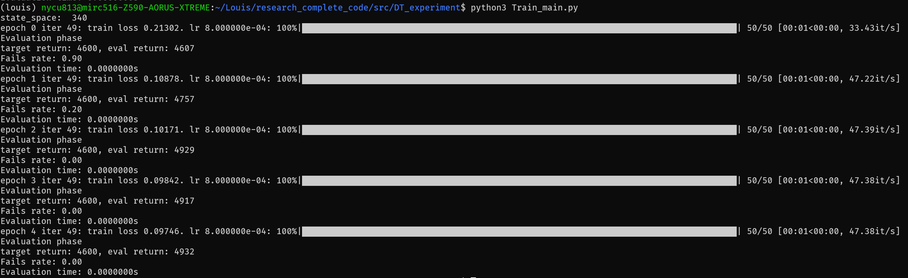

# DT程式說明

## 檔案說明
1. MuMIMOClass
    :    我們的通訊環境是基於這一個函式庫去建立的
2. mingpt/model_atari
    :    這次使用的decision transformer模型結構放在這個檔案裏面
3. mingpt/trainer_atari
    :    製作decision tranformer的訓練器，還有創建評估模型用的環境
4. mingpt/utils
    :    用來讓decisoin transformer可以根據輸入的狀態輸出單一時刻的決策用的函數
6. Train_main
    :    主程式，我們要執行的就是這一個檔案
4. param.json
    :    用來設定實驗參數用的json檔
5. User_10_with_8_RIS_compelete_datasets.npz
    :    透過程式生成出來的訓練用資料集

## 執行方法

1. 首先我們要先進入到一個安裝好的環境，環境目前就是server2-3090當中，並且進入到環境中

```shell!
    conda activate louis
```

2. 到`param.json`當中調整實驗用的參數，這邊我列出幾個可能會被你調整的參數
    *    NumRISEle
            :   RIS反射元件的數量
    *    NumUE
            :   用戶的數量
    *    Bandwidth
            :   通訊環境的頻寬
    *    QoS_exponent
            :   延遲服務品質指數，用於提整QoS嚴格程度，詳情請見論文
    *    LocalDataSize
            :   用戶傳輸的資料量
    *    Position
            :   調整用戶與BS以及RIS的位置
    *    UserActionSpace
            :   用戶可選擇的傳輸功率有幾個
    *    RISActionSpace
            :   RIS可選擇的相位偏移角度有幾個
    *    testing/EPISODES
            :    要執行多少次傳輸後才來評估平均的EEE(Effective Energy Efficiency)
    *    testing/TARGET_RETURN
            :    預期的EEE數值

4. 接著就是執行程式訓練並評估模型
```python!
python3 Train_main.py
```
看到下圖這樣的輸出就代表程式已經執行完成


